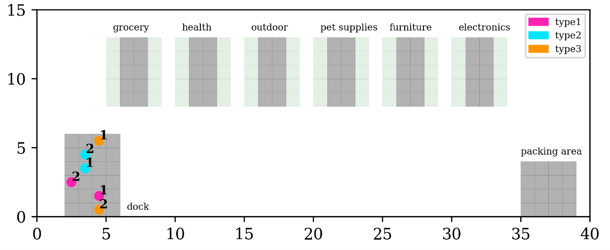
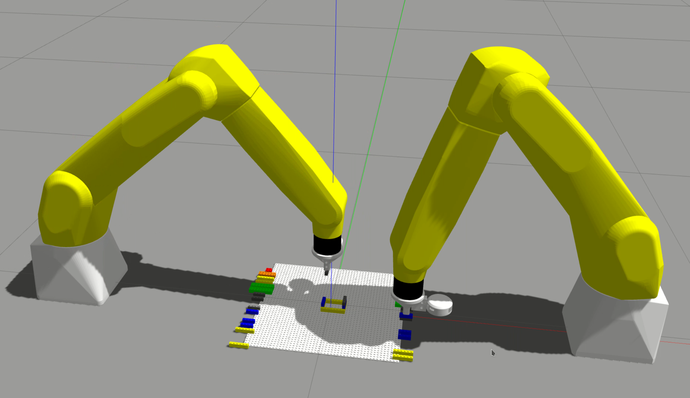
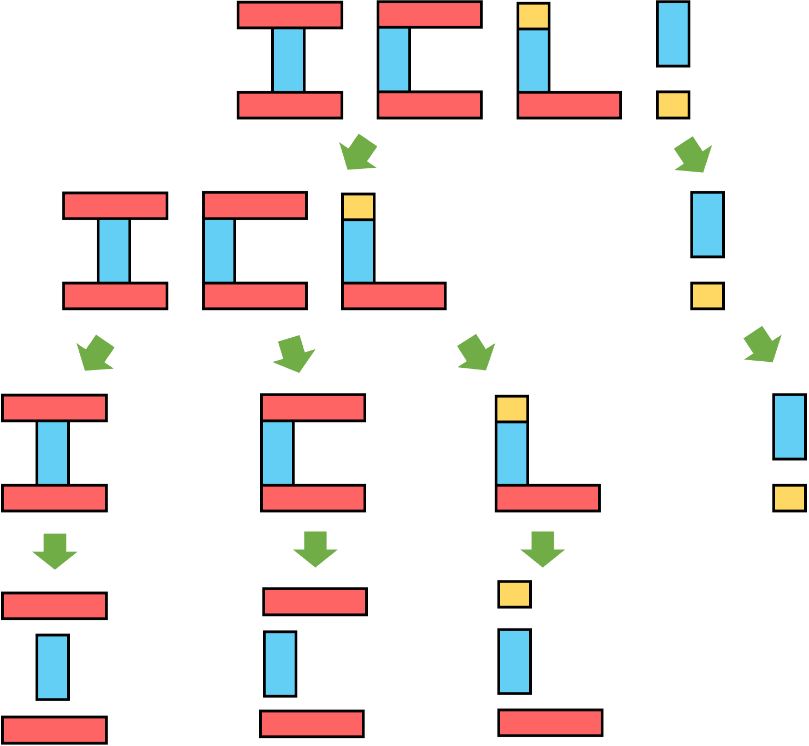

# Hierarchical LTL
Past research into robotic planning with temporal logic specifications, notably Linear Temporal Logic (LTL), was largely based on singular formulas for individual or groups of robots. But with increasing task complexity, LTL formulas unavoidably grow lengthy, complicating interpretation and specification generation, and straining the computational capacities of the planners. In order to maximize the potential of LTL specifications, we capitalized on the intrinsic structure of tasks and introduced a hierarchical structure to LTL specifications. In contrast to the "flat" structure, our hierarchical model has multiple levels of compositional specifications and offers benefits such as greater syntactic brevity, improved interpretability, and more efficient planning. To address tasks under this hierarchical temporal logic structure, we formulated a decomposition-based method. Each specification is first broken down into a range of temporally interrelated  sub-tasks. We further mine the temporal relations among the sub-tasks of different specifications within the hierarchy. Subsequently, a Mixed Integer Linear Program is utilized to generate a spatio-temporal plan for each robot. Our hierarchical LTL specifications were experimentally applied to domains of robotic navigation and manipulation. Results from extensive simulation studies illustrated both the enhanced expressive potential of the hierarchical form and the efficacy of the proposed method.

# Install
The code is tesed using Python 3.10.12. Following the instruction:
```bash
cd /path/to/Hierarchical-LTL
conda env create -f environment.yml
```
### Install ltl2ba
Download the software `LTL2BA` from this [link](http://www.lsv.fr/~gastin/ltl2ba/index.php), and follow the instructions to generate the exectuable `ltl2ba` and then copy it into the folder `Hierarchical-LTL`, same hierarchy level with `main.py`.
### Install solver [Gurobi](https://www.gurobi.com)
# Example
Demo video can be accessible via this [link](https://youtu.be/YbmYmq1RmhI?si=eI1JoR5qIEuFKwWi).
## Navigation Task
We consider an Order Picking Problem (OOP) in a supermarket, which includes three types of robots, each possessing different capabilities, and there are two robots of each type. 


### Case 1
* Initially, a robot of type 1 proceeds to the furniture section and awaits until the arrival of a type 3 robot to assist with the movement of a large piece of furniture; following this, it gathers items from the outdoor and pet sections in no particular sequence.
* A type 2 robot should initiateits task by gathering items from the health section, and only afterwards does it move to the grocery section, ensuring it doesn't visit the grocery section before visiting the health section.
* A type 3 robot moves to the furniture section to assist the type 1 robot. Afterthe items are delivered to the packing area, all robots eventually return to the dock. 
```bash
python main.py --task=nav --case=5 --vis --dot
```
### Case 2
* A type 1 robot should initiate its task by gathering items from the furniture and outdoor sections in any order.
* Following that it gathers items from the health and grocery sections in any order.
* Subsequently it gathers items from the electronics and pet sections again without any specific sequence.
* Once delivering all the items to the packing area, finally it returns to the dock.
```bash
python main.py --task=nav --case=6 --vis --dot
```
### Case 3
* A type 1 robot gathers items from the health, grocery, electronics and pet sections in any order
* Either a type 2 robot or a type 3 robot gathers items from the outdoor section
* After the items are delivered to the packing area, all robots eventually return to the dock.
```bash
python main.py --task=nav --case=8 --vis --dot
```
## Manipulation Task
Two manipulation arms are tasked to assemble some LEGO models given hierarchical LTL specifications.

### Case 4
<!--  -->
```bash
python main.py --task=man --case=5 --vis --dot
```
### Case 5

```bash
python main.py --task=man --case=6 --vis --dot
```
# Citation
```
@article{luo2023robotic,
  title={Robotic Planning under Hierarchical Temporal Logic Specifications},
  author={Luo, Xusheng and Xu, Shaojun and Liu, Ruixuan and Liu, Changliu},
  journal={arXiv preprint arXiv:2308.10393},
  year={2023}
}
```